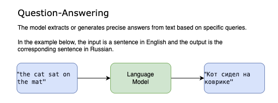

# Translation Tutorial

## Introduction
This folder contains the step by step instructions on how to finetune a question-answering model to translate text from one language to another using the distil labs CLI.

In this particular example, we are translating legal text from English to Russian. The specific legal text consists of statutory frameworks, judicial cross-referencing and sections of text from UK/Common Law texts. Whilst many open-source language models have been trained on multilingual data (i.e. Qwen, Deepseek), they are unlikely to be trained with a specialised domain dataset such as this legal dataset. As such, there is a use-case to finetune a small language model so that it can become specialised for this task.

## Installation

Run the following command to install the distil labs CLI:

```
curl -fsSL https://cli-assets.distillabs.ai/install.sh | sh
```

To ensure everything is installed correctly, run the command:

```
distil
```

And you should see the available commands.

If you haven't already registered, you can do so using the command:

```
distil register
```

If you already have an account, you can enter your username and password when running the command:

```
distil login
```

To verify you have successfully logged in, run:

```
distil whoami
```

## Folder layout

```
├─ data/                    # Job description, train, test & config
├─ README.md                # (This file)
└─ model/                   # Populated after distil‑labs training download
```

## Understanding the data

### Train/test
As mentioned above, this particular dataset consists of input/output pairs where the input is in English and the output is the corresponding text in Russian. The text relates to legal text. The style and complexity of this type of data differs from the type of data language models are typically trained on (i.e. internet data- Reddit, Wikipedia). Given this differing distribution, finetuning is needed to bring language models up to date.

Below is an example input and output:

```
English:
If, on an application made by the liquidator under section 214 of the Insolvency Act 1986, the court finds that at some time before the commencement of the winding up of the company, the person in question knew or ought to have concluded that there was no reasonable prospect that the company would avoid going into insolvent liquidation, the court may declare that that person is to be liable to make such contribution (if any) to the company's assets as the court thinks proper, having regard to the extent of that person's responsibility for the company's liabilities.

Russian:
Если по заявлению, поданному ликвидатором в соответствии с разделом 214 Закона о несостоятельности 1986 года, суд установит, что в какой-то момент до начала ликвидации компании соответствующее лицо знало или должно было прийти к выводу о том, что не существует разумной перспективы того, что компания сможет избежать банкротства, суд может объявить, что это лицо обязано внести такой вклад (если таковой имеется) в активы компании, который суд сочтет надлежащим, учитывая степень ответственности этого лица за обязательства компании.

```

### Job description
The job description consists of three parts:
- task description - a brief summary of the task we are trying to solve
- input description - some context around what the inputs/outputs consist of
- LLM as a judge instructions - instructions to an LLM in how to score the predictions

Below we show the values we use for the above:

```json
{
  "task_description": "Translate the English text to Russian. Translate English text (words, phrases, or sentences) into accurate, natural-sounding Russian while preserving meaning, tone, and register.",
  "input_description": "English legal text consisting of statutory frameworks, judicial cross-referencing and sections of text from UK/Common Law texts.",
  "llm_as_a_judge_instructions": "Evaluate if the predicted translation accurately conveys the English source meaning in natural Russian."
}
```

###  Task type


A task that involves translating from one language to another naturally fits into the `question-answering` task type where we have a single input (in one language) and a single output (the target language).

If you read our docs, you will see that the other task types have other requirements that make them unsuitable for this use-case.

### Config
The config file allows us to have fine-grained control over the pipeline. It allows us to control aspects of the pipeline relating to the tuning, synthetic data generation and evaluation. This is where we can define which teacher models to use, which student model to finetune and a host of other options. When we iterate on our development and try to improve upon our model, we typically make changs to the config and the job description whilst the other inputs remain static.


## Create model and run pipeline using CLI

### Create a model
Run the following command to create a new model:

```
distil model create my-first-model
```

### Upload data
To upload data, run the following command:
```
distil model upload-data <MODEL_ID> --data /Users/user/Documents/translation-tutorial/data
```

(Note that this is the directory that contains: `train.jsonl`, `test.jsonl`, `config.yaml`, `job_description.jsonl`, `unstructured.jsonl` (optional))


To run the teacher evaluation we use the command:

```
distil model run-teacher-evaluation <MODEL_ID>
```

This will take a few minutes to complete, after which you can check the results using the command:

```
distil model teacher-evaluation <MODEL_ID
```

If you are satisfied with the performance, we can proceed to running the full distillation pipeline.

### Run training

To run the full distillation pipeline, run:
```
distil model run-training <MODEL_ID>
```

This process can take 6+ hours to run so you can periodically check the status of the training using the command:

```
distil model training <MODEL_ID>
```

When the training is complete, you can the following command to get the results:

```
distil models show <MODEL_ID>
```

And you can use the following command to download your model and deploy it using the inference framework of your choice (i.e. vLLM, Ollama):

```
distil models download <MODEL_ID>
```